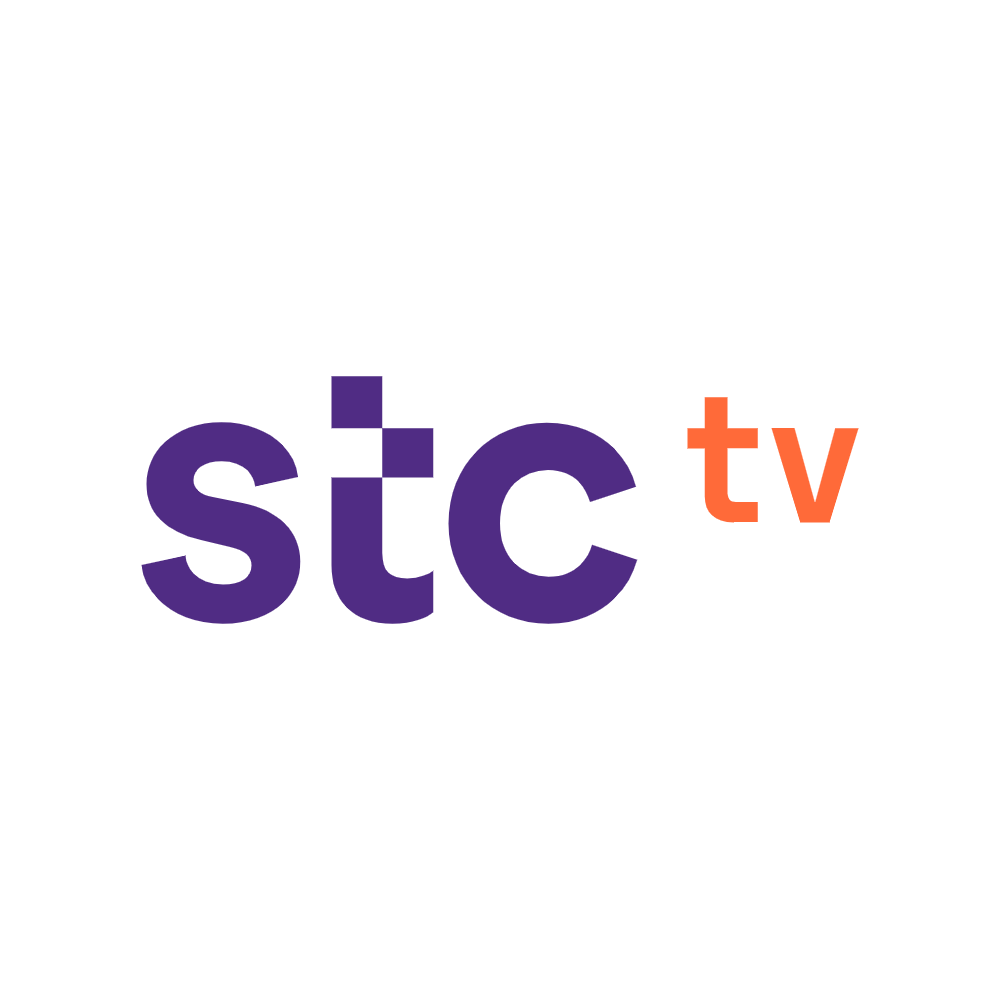

# 📺 STC TV Analytics — Python Project  
📊 **User Behavior Analysis | Time-Series Forecasting | Recommendation System**  
Real-world data-driven project analyzing viewer patterns from STC TV platform using Python.

---

## 🔍 Project Overview  
This end-to-end project explores user engagement on **STC TV**, one of the largest streaming platforms in the region.  
Using three datasets, I analyzed user behavior, predicted future demand, and built a recommendation engine — all in Python.

### 🚀 Project Objectives  
✅ Analyze and classify viewer behavior across movies & series  
✅ Forecast future viewership trends using time-series modeling  
✅ Recommend content based on user preferences with collaborative filtering  
✅ Present clear, actionable insights through charts and summaries

---

## 📂 Datasets Summary  

- **Watch Behavior:** Logs of user sessions including program type, duration, and HD/SD quality  
- **Prediction Model:** Daily total watch time from Jan to March 2018  
- **Recommendation System:** User ratings and viewing history across genres

---

## 📊 Key Visual & Analytical Insights  

### 📍 Watch Behavior Patterns  
  
  
- HD viewers are **more engaged**, but SD viewers represent a larger base.  
- **Top programs** by total watch time were mostly series with high repeat engagement.

---

### 📈 Forecasting Future Demand  
  
- Using **ARIMA**, I predicted viewership for the next two months.  
- Clear **weekly seasonality** found — weekends show spikes.  
- 📅 **March 22, 2018** marked one of the highest viewing peaks.

---

### 🎯 Recommendation System  
  
Built a **collaborative filtering model** that analyzes user similarity to recommend shows.  
**Top 5 Recommendations for Moana Viewers:**
1. Surf's Up: WaveMania  
2. The Birth of a Nation  
3. Alien: Covenant  
4. The Boss Baby  
5. 100 Streets  

---

## 💡 Business Impact & Recommendations  

### 🔹 Summary of Insights  
- **User segmentation** by content type shows different consumption behaviors.  
- **HD users** are smaller in number but contribute to higher total watch time.  
- Viewership is **seasonal**, which supports **time-based promotions**.

### 🔹 Recommended Actions  
- Promote HD subscriptions with targeted offers  
- Push new similar content to users after trending show sessions  
- Schedule premieres and marketing during known viewership peaks

---

## 🛠 Tools & Technologies  
- `Python`  
- `pandas`, `matplotlib`, `plotly`, `scikit-learn`, `statsmodels`  
- Jupyter Notebook  
- Excel `.xlsb` datasets  

---

## 👨‍💻 About Me  
Hi, I'm Shareef Ali — a Data Analyst passionate about solving business problems with clear data stories.  
This STC TV project represents my ability to combine technical skills with strategic thinking.

📬 Let's Connect!  
- **LinkedIn:** [linkedin.com/in/shareef-ali](https://linkedin.com/in/shareef-ali)  
- **GitHub:** [github.com/shareef-ali](https://github.com/shareef-ali)  
- **Portfolio:** [shareef-portfolio.com](https://shareef-portfolio.com)  
- **Email:** sharif.data.analyst@gmail.com

📢 Found this project useful? Feel free to ⭐ it or reach out!
